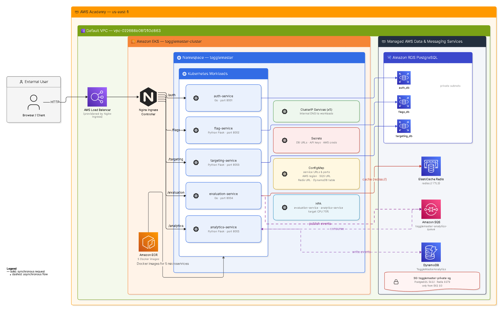

# Tech Challenge - Fase 2

## Migração do ToggleMaster para Microsserviços em Kubernetes na AWS

### Integrantes

| Nome | RM | Discord |
| --- | --- | --- |
| Lucas Gabriel E. Campos | RM371200 | Campalô |
| Rafael Marques Muniz | RM373742 | KaollanRafa |
| Edson Maciel do Vale Junior | RM372784 | EJR_04#8240 |
| João Pedro Soares Oliveira | RM371227 | Jotape |
| Matheus Villão Gonçalves | RM370682 | villao. |

### Links

- Repositório GitHub: https://github.com/mathvillao/togglemaster-tech-challenge-fase-2.git
- Vídeo demonstrativo: https://youtu.be/NDFY0PQ9oQs?si=wv0zMjZN6zacrQ2S

---

## 1. Resumo do Projeto

O objetivo deste Tech Challenge foi migrar o ToggleMaster de uma arquitetura monolítica para uma arquitetura baseada em microsserviços, com conteinerização via Docker, orquestração em Kubernetes e implantação em ambiente AWS utilizando Amazon EKS.

A solução foi dividida em cinco microsserviços independentes:

| Microsserviço | Linguagem | Responsabilidade | Dependências |
| --- | --- | --- | --- |
| auth-service | Go | Gerenciamento e validação de chaves de API | PostgreSQL |
| flag-service | Python/Flask | Cadastro e consulta de feature flags | PostgreSQL |
| targeting-service | Python/Flask | Cadastro e consulta de regras de segmentação | PostgreSQL |
| evaluation-service | Go | Avaliação de flags para usuários | Redis, SQS, flag-service, targeting-service |
| analytics-service | Python/Flask | Consumo de eventos e persistência analítica | SQS, DynamoDB |

Além da migração funcional, foram aplicadas práticas de conteinerização, segurança, organização de configuração, escalabilidade e observabilidade para aproximar a entrega de um ambiente real de produção.

---

## 2. Arquitetura da Solução

A arquitetura final utiliza o Amazon EKS como ambiente principal de execução dos microsserviços. O acesso externo ocorre por meio de um Load Balancer provisionado pelo Nginx Ingress Controller, que roteia as chamadas por path para cada serviço interno do cluster.

**Figura 1 - Arquitetura da solução ToggleMaster em microsserviços no AWS EKS, com roteamento via Nginx Ingress, armazenamento em RDS PostgreSQL, cache com ElastiCache Redis, mensageria com SQS e persistência analítica no DynamoDB.**

Principais decisões arquiteturais:

- Cada microsserviço possui seu próprio container e manifesto Kubernetes.
- Os serviços internos usam `ClusterIP`, mantendo comunicação privada dentro do cluster.
- O acesso externo é centralizado pelo Ingress.
- Dados transacionais foram separados em três bancos PostgreSQL no Amazon RDS.
- O Redis foi provisionado no Amazon ElastiCache para cache de avaliações.
- O fluxo analítico foi desacoplado com Amazon SQS e persistido no Amazon DynamoDB.
- Configurações foram separadas em `ConfigMap` e dados sensíveis em `Secret`.
- `evaluation-service` e `analytics-service` possuem HPA com alvo de CPU em 70%.

---

## 3. Conteinerização e Ambiente Local

Foram criados Dockerfiles para os cinco microsserviços. Os serviços em Go utilizam build multi-stage, reduzindo o tamanho da imagem final. Os serviços Python utilizam imagens Alpine atualizadas e executam com usuário não-root.

Também foi criado um `docker-compose.yaml` para executar localmente os nove containers exigidos:

- 5 containers de aplicação;
- 2 containers PostgreSQL;
- 1 container Redis;
- 1 container DynamoDB Local.

No ambiente local, foram validados:

- build das cinco imagens;
- health check de todos os serviços;
- criação de chave de API;
- criação de feature flag;
- criação de regra de targeting;
- avaliação de flag via `evaluation-service`;
- integração com Redis;
- execução do `analytics-service` com DynamoDB Local.

Durante a conteinerização, também foram corrigidos problemas de build nos serviços Go, como imports não utilizados e dependências incompatíveis.

---

## 4. Hardening das Imagens Docker

Após a primeira versão dos Dockerfiles, foi realizada uma etapa de melhoria das imagens para reduzir vulnerabilidades e deixar os containers mais adequados.

Melhorias aplicadas:

- atualização das imagens base;
- uso de `python:3.13-alpine3.24` nos serviços Python;
- uso de `golang:1.25-alpine3.24` com runtime `alpine:3.24` nos serviços Go;
- atualização de dependências Python;
- execução dos containers de aplicação com usuário não-root;
- organização do `.dockerignore` e das dependências;
- validação das imagens com Docker Scout.

Após os ajustes, as imagens dos cinco microsserviços ficaram sem vulnerabilidades críticas ou altas detectadas no ambiente local.

---

## 5. Infraestrutura AWS

A infraestrutura em nuvem foi criada na região `us-east-1`, utilizando o ambiente AWS Academy.

Recursos provisionados:

| Serviço AWS | Recurso | Finalidade |
| --- | --- | --- |
| Amazon ECR | 5 repositórios | Armazenar as imagens Docker dos microsserviços |
| Amazon EKS | 1 cluster | Orquestrar os containers Kubernetes |
| Amazon RDS PostgreSQL | 3 instâncias | Bancos para auth, flags e targeting |
| Amazon ElastiCache Redis | 1 cache Redis | Cache do evaluation-service |
| Amazon DynamoDB | 1 tabela | Persistência dos eventos analíticos |
| Amazon SQS | 1 fila | Comunicação assíncrona entre evaluation e analytics |
| Elastic Load Balancer | 1 Load Balancer | Entrada HTTP criada pelo Nginx Ingress |
| Security Groups | Regras privadas | Controle de acesso entre EKS, RDS e Redis |

As imagens foram enviadas para o ECR com a tag `latest`:

- `auth-service`;
- `flag-service`;
- `targeting-service`;
- `evaluation-service`;
- `analytics-service`.

---

## 6. Bancos e Serviços Gerenciados

Foram criados três bancos no Amazon RDS PostgreSQL:

| Banco | Serviço |
| --- | --- |
| auth_db | auth-service |
| flags_db | flag-service |
| targeting_db | targeting-service |

Para inicializar as tabelas, foram criados Jobs Kubernetes específicos:

- `auth-db-init`;
- `flag-db-init`;
- `targeting-db-init`.

O Redis foi provisionado no ElastiCache com conexão TLS, utilizando a URL com protocolo `rediss://`.

O DynamoDB foi criado com a tabela `ToggleMasterAnalytics`, utilizando `event_id` como chave de partição.

A fila SQS `togglemaster-analytics-queue` foi usada para desacoplar o envio de eventos de avaliação do processamento analítico.

---

## 7. Kubernetes e Manifestos

Os manifestos Kubernetes foram organizados na pasta `k8s/`:

- `00-namespace.yaml`;
- `01-secrets.example.yaml`;
- `02-configmaps.yaml`;
- manifests de aplicação em `k8s/apps/`;
- manifests de Jobs em `k8s/jobs/`;
- manifests de HPA em `k8s/hpa/`;
- manifesto de Ingress em `k8s/ingress/`.

Cada microsserviço possui:

- `Deployment`;
- `Service` do tipo `ClusterIP`;
- probes de saúde;
- requests e limits de CPU/memória;
- variáveis vindas de `ConfigMap` e `Secret`.

O namespace utilizado foi `togglemaster`.

---

## 8. Ingress e Roteamento Externo

Foi instalado o Nginx Ingress Controller no cluster EKS. O controller criou um Load Balancer externo na AWS.

Rotas configuradas:

| Path | Serviço |
| --- | --- |
| `/auth` | auth-service |
| `/flags` | flag-service |
| `/targeting` | targeting-service |
| `/evaluation` | evaluation-service |
| `/analytics` | analytics-service |

Todos os endpoints de health check foram testados com sucesso por meio do endereço externo do Load Balancer.

---

## 9. Escalabilidade

Foram criados HPAs para os serviços mais críticos do fluxo:

| HPA | Serviço | Métrica | Alvo | Réplicas |
| --- | --- | --- | --- | --- |
| evaluation-service-hpa | evaluation-service | CPU | 70% | 1 a 3 |
| analytics-service-hpa | analytics-service | CPU | 70% | 1 a 3 |

O Metrics Server foi instalado e validado com `kubectl top nodes` e `kubectl top pods`.

Também foi executado teste de carga para demonstrar o comportamento de escalabilidade do `evaluation-service`.

---

## 10. Segurança e Configuração

Boas práticas aplicadas:

- não versionamento de arquivos com credenciais reais;
- criação de `.env.example` e `01-secrets.example.yaml`;
- uso de Kubernetes Secrets para URLs de banco, chaves de API e credenciais AWS temporárias;
- uso de ConfigMap para valores não sensíveis;
- bancos RDS e Redis sem exposição pública;
- Security Group permitindo PostgreSQL e Redis somente a partir do Security Group do EKS;
- containers executando com usuário não-root;
- imagens base atualizadas e validadas.

Como o ambiente utilizado foi o AWS Academy, as credenciais AWS temporárias precisam ser renovadas a cada nova sessão de laboratório.

---

## 11. Testes Realizados

Foram realizados testes em três níveis.

### Ambiente Local

- `docker compose up`;
- validação dos nove containers;
- health checks dos cinco serviços;
- criação de flag e regra;
- avaliação de feature flag;
- validação do fluxo local com Redis e DynamoDB Local.

### Ambiente AWS/EKS

- validação dos nodes do EKS;
- validação dos pods no namespace `togglemaster`;
- validação dos Services `ClusterIP`;
- execução dos Jobs de inicialização dos bancos;
- validação do Ingress externo;
- health checks via Load Balancer;
- validação de comunicação com RDS, Redis, SQS e DynamoDB.

### Fluxo Funcional

O fluxo principal validado foi:

1. criação de uma chave de API pelo `auth-service`;
2. criação de uma feature flag pelo `flag-service`;
3. criação de regra de targeting pelo `targeting-service`;
4. avaliação da flag pelo `evaluation-service`;
5. envio do evento para SQS;
6. consumo do evento pelo `analytics-service`;
7. persistência do evento no DynamoDB.

---

## 12. Resultado Final

O ToggleMaster foi executado com sucesso em arquitetura de microsserviços no Kubernetes, com imagens armazenadas no ECR e infraestrutura AWS gerenciada para banco, cache, mensageria e analytics.

A solução atende aos principais requisitos do Tech Challenge:

- Dockerfiles para os cinco microsserviços;
- Docker Compose com os nove containers exigidos;
- ECR com uma imagem por serviço;
- EKS funcional;
- RDS PostgreSQL;
- ElastiCache Redis;
- DynamoDB;
- SQS;
- Metrics Server;
- Nginx Ingress Controller;
- manifests Kubernetes;
- HPAs para `evaluation-service` e `analytics-service`;
- vídeo demonstrativo;
- repositório versionado no GitHub.

---

## 13. Conclusão

A entrega demonstra a migração do ToggleMaster para uma arquitetura moderna baseada em microsserviços, com separação clara de responsabilidades, infraestrutura gerenciada na AWS, execução em Kubernetes e mecanismos de escalabilidade.

Além dos requisitos obrigatórios, foram aplicadas melhorias de segurança, hardening das imagens, organização dos manifests, validação de vulnerabilidades e documentação detalhada da solução.

Essa abordagem torna o sistema mais modular, escalável e preparado para evoluções futuras, como CI/CD, uso de IRSA para credenciais AWS, KEDA para escalabilidade baseada na fila SQS e observabilidade mais avançada com Prometheus e dashboards.
